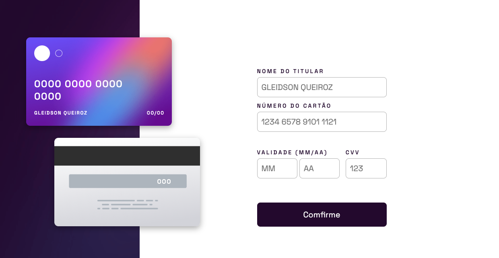

# 💻 Frontend Mentor - Interactive Card

[🚀 Acesse aqui](https://interactive-card-queiroz.vercel.app/)

## 💻 O desafio

O desafio é criar este formulário interativo de detalhes do cartão e deixá-lo o mais próximo possível do design.

## 🛠 Tecnologias

- HTML
- CSS
- Javascript
- Git
- GitHub

<table>
  <tr>
    <td>
     
    </td>
    <td>
      Feito por Gleidson Queiroz.</a> 🙋🏼‍♂️
    </td>
  </tr>
</table>
